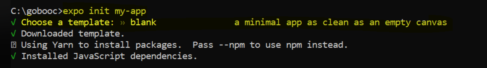
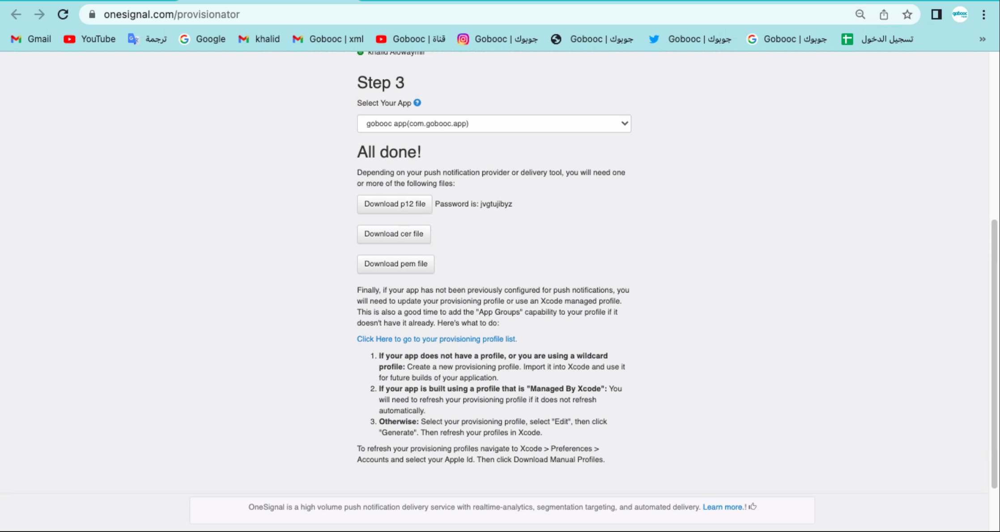
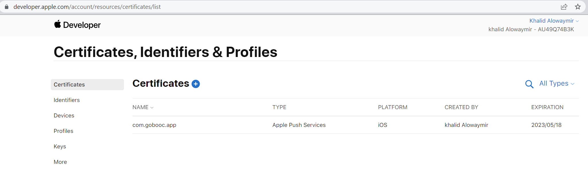
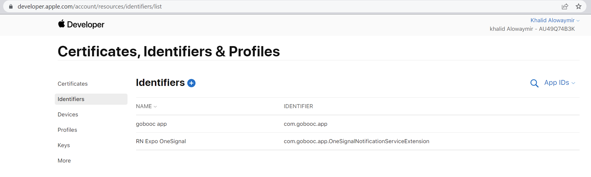
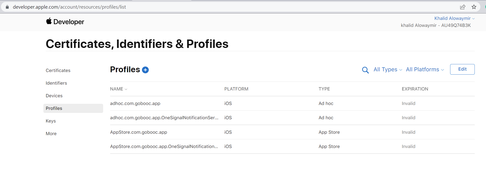
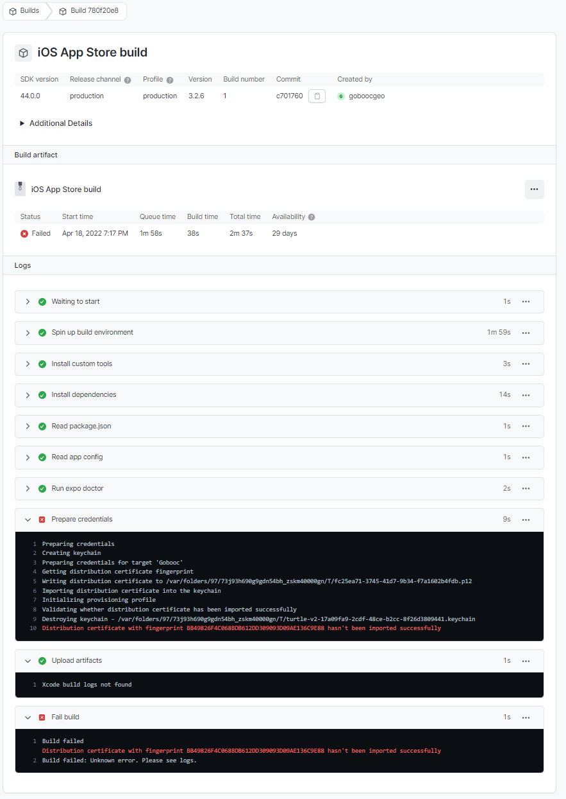
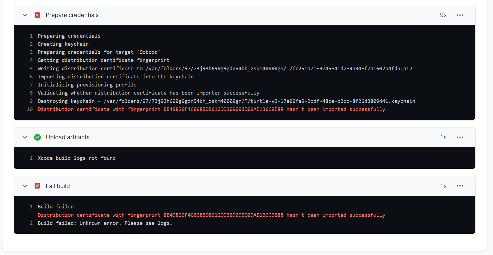

# React Native Expo integration to OneSignal Project Configs

### React Native Expo
*Expo project template:*

*OneSignal Integration to RN Expo + EAS using this guidelines/document:*
[iOS Credentials Guide: OneSignal + EAS](https://github.com/OneSignal/onesignal-expo-plugin/blob/main/IOS_CREDENTIALS_EAS.md#4-add-the-profiles-to-your-credentialsjson-file)

*IOS certificate using:*
[Push Notification Certificate Wizard (OneSignal)](https://onesignal.com/provisionator)

### Apple Developer (Certificates, Identifiers & Profiles)
*certificates screenshot:*

*identifiers screenshot:*

*profiles screenshot:*

# Expo/EAS IOS build error
*Error screenshots:*

